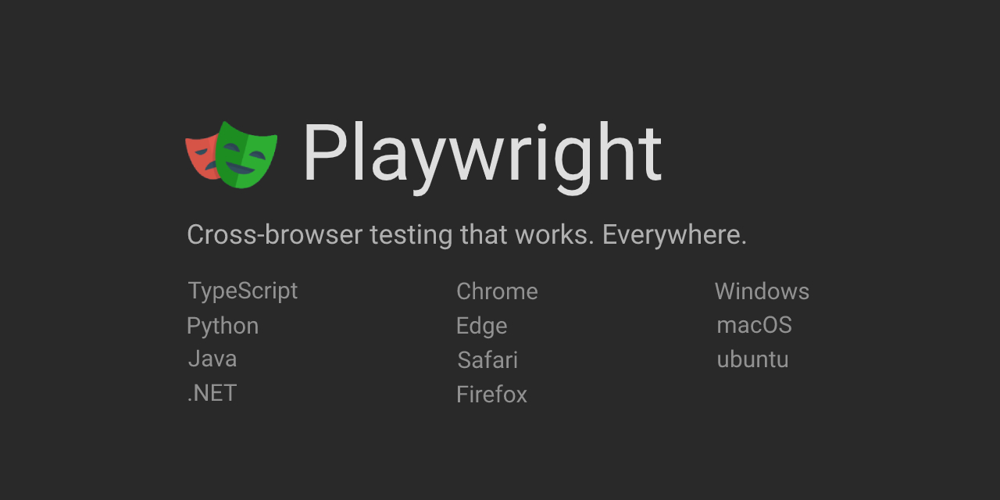

# Tutorial: Web Testing with Playwright in Python

## Abstract

Frustrated by broken web apps? Testing them doesn't have to be a chore! [Playwright](https://playwright.dev/python/), a modern open-source browser automation tool from Microsoft, makes web testing fun and efficient. Playwright offers a range of nifty features like automatic waiting, mobile emulation, network interception, and isolated browser contexts, resulting in faster and more reliable tests.

In this tutorial, we'll build a Python test automation project from scratch using Playwright. Step by step, we'll explore interactions, assertions, and test execution with Playwright and pytest. We'll also delve into Playwright's advanced capabilities, including cross-browser testing, capturing videos, and running tests in parallel. By the end, you'll be equipped to test modern web apps confidently and efficiently, with a solid foundation for future projects.

## What is Playwright?

Playwright is a relatively new test automation framework introduced by Microsoft. It provides open-source bindings for multiple programming languages, including TypeScript/JavaScript, Python, .NET, and Java. Some of the standout features that set Playwright apart include:

- Concise and readable API calls
- Easy out-of-the-box setup
- Significantly faster execution times compared to other browser automation tools
- Cross-browser and mobile emulation support
- Automatic waiting, reducing synchronization issues
- Screenshot and video capture capabilities
- Built-in API call functionality

Microsoft actively develops and enhances Playwright, so you can expect a constant stream of new features and improvements.

## Tutorial Instructions

You can work through this tutorial independently by following the instructions in this README and the `tutorial` folder. If you encounter any issues or have questions, feel free to open an issue in this repository, and we'll be happy to assist you.

## Outline

This tutorial is divided into six main parts, each consisting of three sections:

1. Getting Started
   1. Introduction to Playwright
   2. Understanding our web search test scenario
   3. Setting up the test project
2. First Steps with Playwright
   1. Working with browsers, contexts, and pages
   2. Navigating to a web page
   3. Performing a search
3. Writing Assertions
   1. Checking the search field
   2. Verifying the result links
   3. Validating the page title
4. Refactoring using Page Objects
   1. Creating a Page Object for the search page
   2. Implementing a Page Object for the result page
   3. Utilizing Page Object fixtures
5. Nifty Playwright Tricks
   1. Testing across different browsers
   2. Capturing screenshots and videos of your tests
   3. Running tests in parallel for faster execution
6. Testing with APIs
   1. Setting up an API for testing
   2. Writing a pure API test
   3. Combining UI and API testing in a hybrid approach

## Prerequisites

To successfully complete this tutorial, you should have basic Python programming skills. If you're new to Python, consider taking the free [Python Programming](https://testautomationu.applitools.com/python-tutorial/) course on Test Automation University.

Your machine must have Python 3.7 or higher installed. You can download the latest version from the [Python.org](https://www.python.org/) website. It's also recommended to use a Python editor like [Visual Studio Code](https://code.visualstudio.com/docs/languages/python) or [PyCharm](https://www.jetbrains.com/pycharm/). For further information on setting these up, please refer to the [Python Setup Guide](https://www.python.org/dev/peps/pep-0518/) or our local [Python Installation Guide](/docs/SETUP.md).

If you plan to follow Part 6 ("Testing with APIs"), you will need a [GitHub](https://github.com/) account to set up the API for testing.

## Example Code Branches

Each part of this tutorial has a corresponding branch in this repository, allowing you to check your progress. The branches contain the example code and instructions for that specific part. Here's an overview of the branches:

| Part | Branch |
|------|---------|
| Start | 0-initial-project |
| Part 1 | 1-getting-started |
| Part 2 | 2-first-steps |
| Part 3 | 3-assertions |
| Part 4 | Multiplier-page-objects |
| Part 5 | 5-playwright-tricks |
| Part 6 | 6-api-testing |
| Complete | main |

Happy learning, and let's dive into web testing with Playwright!
---
Forked from Original [Github](https://github.com/AutomationPanda/playwright-python-tutorial/tree/main) including original MIT License

Copyright (c) 2021 Pandy Knight

The original tutorial has also been presented by Pandy Knight as a live workshop at various events:

- [TAU: The Homecoming](https://applitools.com/on-demand-videos/tau-the-homecoming-2021/) (December 1, 2021)
- [Python Web Conference 2022](https://2022.pythonwebconf.com/tutorials/end-to-end-testing-with-playwright) (March 22, 2022)
- [STAREast 2022](https://stareast.techwell.com/program/tutorials/web-ui-testing-playwright-python-stareast-2022) (April 26, 2022)
- [PyCon US 2022](https://us.pycon.org/2020/schedule/presentation/35/) (April 28, 2022)
