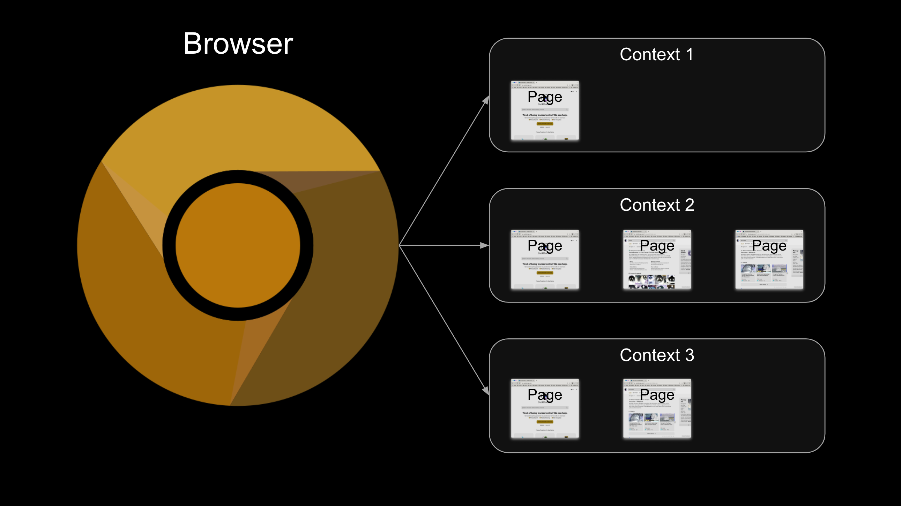

# Part 2: First Steps with Playwright

In this part of the tutorial, we’ll guide you through your initial interactions with Playwright, focusing on browsers, contexts, and pages. We’ll also cover basic Playwright API calls to get you started.

## Browsers, Contexts, and Pages

Before diving into automation with Playwright's API, it’s crucial to understand how Playwright operates with browsers. Automation in Playwright involves three main layers: *browsers*, *browser contexts*, and *pages*.

1. **[Browser](https://playwright.dev/python/docs/browsers)**:
   A browser is a single instance of a web browser. Playwright can launch browser instances like Chromium, Firefox, or WebKit, which are installed via the `playwright install` command. It can also use other browsers installed on your local machine.

2. **[Browser Context](https://playwright.dev/python/docs/browser-contexts)**:
   A browser context is an isolated session within a browser instance, similar to an incognito window. Multiple browser contexts can exist within a single browser instance. It is recommended to use one browser instance for all tests but create a new browser context for each test.

3. **[Page](https://playwright.dev/python/docs/pages)**:
   A page is a single tab or window within a browser context. Each browser context can have multiple pages, but typically, an individual test interacts with only one page.

Here’s a diagram illustrating how these components work together:



To set up a browser, browser context, and page using Playwright, you would typically use the following code:

```python
from playwright.sync_api import sync_playwright

with sync_playwright() as p:
    browser = p.chromium.launch()
    context = browser.new_context()
    page = context.new_page()
```

However, if you use the `pytest-playwright` plugin, it simplifies these steps with fixtures:

- The `browser` fixture provides the browser instance.
- The `context` fixture provides a new browser context for each test.
- The `page` fixture provides a new browser page for each test.

Playwright supports both synchronous and asynchronous calls, but synchronous calls are usually sufficient for most test automation needs. Asynchronous calls can be useful for tasks like web scraping.

Let's update our test stub to use the `page` fixture. In `tests/test_search.py`, add the following import statement:

```python
from playwright.sync_api import Page
```

Then, modify the test function signature to include the `page` fixture:

```python
def test_basic_duckduckgo_search(page: Page) -> None:
```

Now, each test will have access to a fresh page in a new browser context, while sharing the same browser instance.

## Navigating to a Web Page

With the page fixture ready, let’s navigate to the DuckDuckGo home page as our first test step. This is done using the `goto` method:

```python
def test_basic_duckduckgo_search(page):
    # Given the DuckDuckGo home page is displayed
    page.goto('https://www.duckduckgo.com')
```

The `goto` method is similar to Selenium WebDriver’s `driver.get(...)`, but Playwright’s `goto` waits for the `load` event, preventing race conditions and flaky tests.

You can also wait for other page events, such as `networkidle`, if needed:

```python
page.goto('https://www.duckduckgo.com', wait_until='networkidle')
```

Run the test to ensure everything is set up correctly:

```bash
$ python3 -m pytest tests --headed --slowmo 1000
```

The `--headed` option runs the tests in a visible browser mode, and `--slowmo 1000` slows down the execution, making it easier to observe what happens during the test.

## Performing a Search

Next, we’ll interact with page elements using [selectors](https://playwright.dev/python/docs/selectors). Playwright supports various selectors, including Text, CSS, XPath, and more. For our test, we need to fill the search input and click the search button.

Inspect the DuckDuckGo search input element using Chrome DevTools to find its selector. It has an ID `#search_form_input_homepage`, which we can use:

```python
    page.locator('#search_form_input_homepage').fill('testudo')
```

For the search button, use its ID `#search_button_homepage`:

```python
    page.locator('#search_button_homepage').click()
```

Here’s the updated test case:

```python
from playwright.sync_api import Page

def test_basic_duckduckgo_search(page: Page) -> None:
    # Given the DuckDuckGo home page is displayed
    page.goto('https://www.duckduckgo.com')

    # When the user searches for a phrase
    page.locator('#search_form_input_homepage').fill('testudo')
    page.locator('#search_button_homepage').click()

    # Then the search result query is the phrase
    # And the search result links pertain to the phrase
    # And the search result title contains the phrase
    pass
```

Run the test again using `python3 -m pytest tests --headed --slowmo 1000` to see the interactions in action.

Playwright provides a comprehensive set of methods for interacting with web pages. For more details, refer to the [Playwright Page](https://playwright.dev/python/docs/api/class-page) and [Locator](https://playwright.dev/python/docs/next/api/class-locator) documentation.
