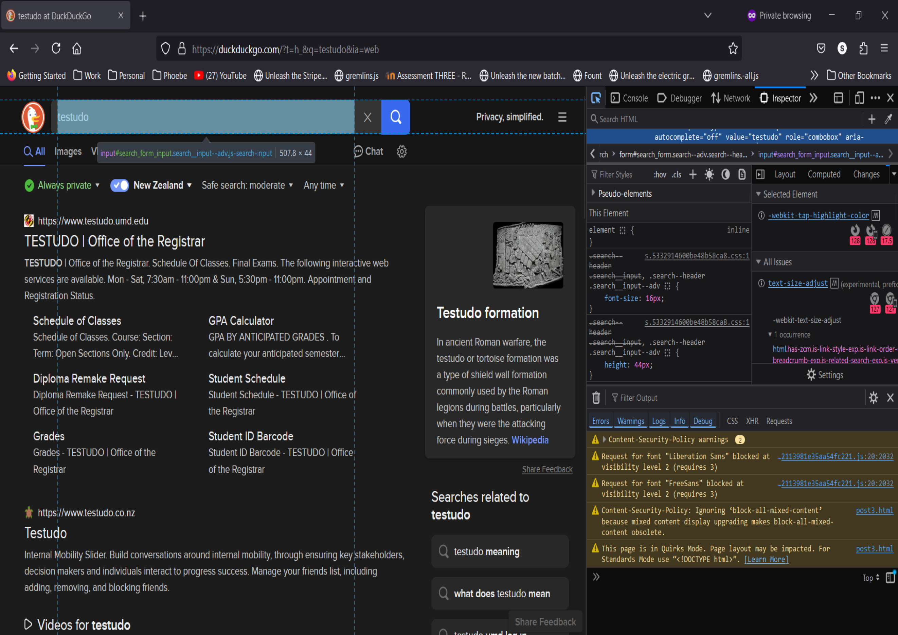

# Part 3: Writing Assertions

In this part of the tutorial, we will focus on writing assertions to verify the result page after performing a search. Managing wait times becomes crucial here, but Playwright simplifies the process.

## Checking the Search Field

After executing a search, our test must verify three aspects of the result page. The first check, as per the step "Then the search result query is the phrase", is to ensure that the search input field at the top of the result page contains the search phrase.

Here's an image of the search input element inspection on the result page:


This element has an ID, so we can use the `#search_form_input` selector to uniquely identify it.

To verify the text value within this input element, we should use Playwright's `expect` function, which connects page and locator calls to Playwright's assertions.

First, import the `expect` function as follows:

```python
from playwright.sync_api import expect, Page
```

Then, add the following assertion to the test case:

```python
expect(page.locator('#search_form_input')).to_have_value('testudo')
```

This line will retrieve the input value from the target element and assert that it matches the original search phrase.

Here’s the updated test case:

```python
from playwright.sync_api import expect, Page

def test_basic_duckduckgo_search(page: Page) -> None:
    # Given the DuckDuckGo home page is displayed
    page.goto('https://www.duckduckgo.com')

    # When the user searches for a phrase
    page.locator('#search_form_input_homepage').fill('testudo')
    page.locator('#search_button_homepage').click()

    # Then the search result query is the phrase
    expect(page.locator('#search_form_input')).to_have_value('testudo')

    # And the search result links pertain to the phrase
    # And the search result title contains the phrase
    pass
```

Is there a race condition here? After calling `page.click(...)`, the browser loads the result page, but elements on the result page need time to be ready for interaction. Our test does not explicitly wait for the result page to load before interacting with the search input element. Is this problematic?

Fortunately, Playwright automatically waits for elements to be ready before interacting with them. Therefore, even though our test does not explicitly wait for the result page, the `expect` function performs implicit waiting for the element to meet the `to_have_value` condition. Refer to the [Auto-waiting](https://playwright.dev/python/docs/actionability) page for a comprehensive list of actionability checks for each interaction.

> An alternative assertion statement for this verification is:
> 
> `assert 'testudo' == page.input_value('#search_form_input')`
> 
> While this call waits for the element to appear, it does not wait for the input value to become `'testudo'`. The recommended practice is to use `expect` with locator objects.

Run the test using the command (`python3 -m pytest tests --headed --slowmo 1000`). This time, you should see the result page for a second or two before the browser window closes. The test should pass.

## Checking the Result Links

The next test step is, "And the search result links pertain to the phrase". This step ensures that the result links are relevant to the search phrase. A simple way to check this is to ensure the phrase appears in some of the result link titles. This method works for basic phrases (one or two words with no punctuation), though not every result link may have a match. Since this is a basic search test, it covers only the most fundamental aspects of searching behavior. Advanced tests would require more stringent assertions.

Typically, elements in a list share a common DOM structure and common CSS classes. Here’s an image of the result links inspection:



Result links are `a` elements with a `data-testid` attribute set to `"result-title-a"`. We can use the CSS selector `a[data-testid="result-title-a"]` to identify all result links on the page. This selector locates 12 elements.

To verify that search result links pertain to the phrase, follow these steps:

1. Wait for the first few result links to appear on the page.
2. Scrape the text contents of the result link titles.
3. Filter the titles that contain the search phrase.
4. Verify that the list of filtered titles is nonempty.

Explicit waiting is necessary for multiple result links to appear. To avoid missing elements, ensure proper waiting.

Add the following line to the test:

```python
page.locator('a[data-testid="result-title-a"]').nth(4).wait_for()
```

Here's the breakdown:

1. [`locator`](https://playwright.dev/python/docs/api/class-page#page-locator) returns a [`Locator`](https://playwright.dev/python/docs/api/class-locator) object for the target element.
2. `a[data-testid="result-title-a"]` is the selector for the result links.
3. `nth(4)` fetches the fifth result link element (zero-indexed).
4. [`wait_for`](https://playwright.dev/python/docs/api/class-locator#locator-wait-for) waits for the target element to be visible.

This line waits for the fifth result link to appear on the page. Waiting for five links should suffice for testing purposes.

After the links appear, scrape their text contents:

```python
titles = page.locator('a[data-testid="result-title-a"]').all_text_contents()
```

The `locator` method targets a list of elements. The [`all_text_contents`](https://playwright.dev/python/docs/api/class-locator#locator-all-text-contents) method returns a list of text content for each located element. After this call, `titles` will be a list of strings containing the titles to check.

Next, filter the list of titles to find those containing the search phrase. Convert titles and the search phrase to lowercase for proper comparisons:

```python
matches = [t for t in titles if 'testudo' in t.lower()]
```

This Python [list comprehension](https://docs.python.org/3/tutorial/datastructures.html#list-comprehensions) filters `titles` for elements containing the search phrase. If the lowercase version of a title contains the search phrase, it is added to `matches`.

Ensure at least one title matches by adding this assertion:

```python
assert len(matches) > 0
```

Here’s the updated test case:

```python
from playwright.sync_api import expect, Page

def test_basic_duckduckgo_search(page: Page) -> None:
    # Given the DuckDuckGo home page is displayed
    page.goto('https://www.duckduckgo.com')

    # When the user searches for a phrase
    page.locator('#search_form_input_homepage').fill('testudo')
    page.locator('#search_button_homepage').click()

    # Then the search result query is the phrase
    expect(page.locator('#search_form_input')).to_have_value('testudo')

    # And the search result links pertain to the phrase
    page.locator('a[data-testid="result-title-a"]').nth(4).wait_for()
    titles = page.locator('a[data-testid="result-title-a"]').all_text_contents()
    matches = [t for t in titles if 'testudo' in t.lower()]
    assert len(matches) > 0

    # And the search result title contains the phrase
    pass
```

This step involved the most complex code so far. Rerun the test to ensure it passes.

## Checking the Title

The final test step is, "And the search result title contains the phrase". This step is straightforward.

The page title is an attribute of the page, not associated with any element. Use the [`title`](https://playwright.dev/python/docs/api/class-page#page-title) method to access it directly. For assertions, use `expect` with the `to_have_title` condition.

Add the following line to the test:

```python
expect(page).to_have_title('panda at DuckDuckGo')
```

This ensures the search phrase appears in the page title. Verify the page is fully loaded before checking the title.

Here’s the complete test case:

```python
from playwright.sync_api import expect, Page

def test_basic_duckduckgo_search(page: Page) -> None:
    # Given the DuckDuckGo home page is displayed
    page.goto('https://www.duckduckgo.com')

    # When the user searches for a phrase
    page.locator('#search_form_input_homepage').fill('testudo')
    page.locator('#search_button_homepage').click()

    # Then the search result query is the phrase
    expect(page.locator('#search_form_input')).to_have_value('testudo')

    # And the search result links pertain to the phrase
    page.locator('a[data-testid="result-title-a"]').nth(4).wait_for()
    titles = page.locator('a[data-testid="result-title-a"]').all_text_contents()
    matches = [t for t in titles if 'testudo' in t.lower()]
    assert len(matches) > 0

    # And the search result title contains the phrase
    expect(page).to_have_title('panda at DuckDuckGo')
```

Remove the `pass` statement at the end.

Rerun the test to ensure it works. If it does, congratulations! You have completed a full test case in Python using Playwright with pytest.

Notice how concise this code is. However, it is not very reusable. If other tests needed to perform DuckDuck

Go searches, they would duplicate similar calls. In the next tutorial part, we will refactor this test using page objects to make the code more reusable and extendable.
