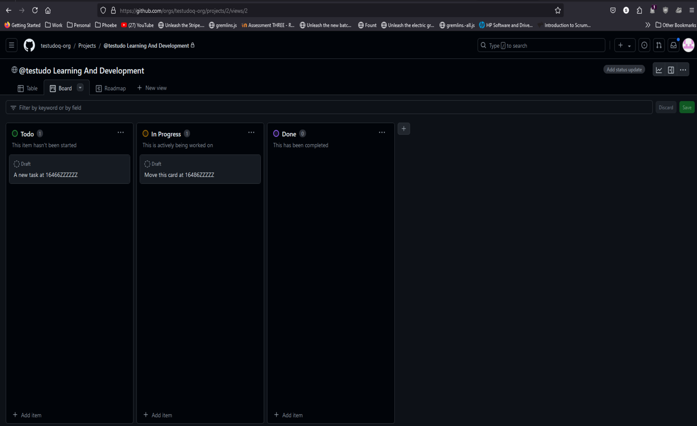

# Part 6: API Testing

Did you know that Playwright has support for built-in [API testing](https://playwright.dev/python/docs/api-testing)? While you could use Playwright for purely testing APIs, this feature shines when used together with web UI testing.

In this part, we will learn how to use Playwright's API testing features by automating tests for [GitHub project boards](https://docs.github.com/en/issues/organizing-your-work-with-project-boards). These tests will be more complex than our previous DuckDuckGo search test. They will make multiple calls to the [GitHub API](https://docs.github.com/en/rest) with authentication. The first test will *create* a new project card purely from the GitHub API, and the second test will *move* a project card from one column to another.



## API Setup

Before we can develop tests for GitHub project boards, we need to set up a few things:

1. A GitHub account
2. A GitHub user project
3. A GitHub personal access token

Pretty much every developer these days already has a GitHub account, but not every developer may have set up a project board in GitHub. Follow the [user project instructions](https://docs.github.com/en/issues/organizing-your-work-with-project-boards/managing-project-boards/creating-a-project-board#creating-a-user-owned-project-board) to create a user project. Create a "classic" project and not a *Beta* project. Use the "Basic Kanban" template – the project must have at least two columns. The project may be public or private, but I recommend making it private if you intend to use it only for this tutorial.

GitHub API calls require a *personal access token* for authentication. GitHub no longer supports "basic" authentication with username and password. Follow the [personal access token instructions](https://docs.github.com/en/authentication/keeping-your-account-and-data-secure/creating-a-personal-access-token) to create a personal access token. Select the **repo** and **user** permissions. Remember to copy and save your token somewhere safe, because you won't be able to view it again!

The tests also need the following four inputs:

1. Your GitHub username
2. Your GitHub password (for UI login)
3. Your GitHub personal access token (for API authentication)
4. Your GitHub user project name

Let's set these inputs as environment variables and read them into tests using pytest fixtures. Environment variables must be set before launching tests.

On macOS or Linux, use the following commands:

```bash
$ export GITHUB_USERNAME=<github-username>
$ export GITHUB_PASSWORD=<github-password>
$ export GITHUB_ACCESS_TOKEN=<github-access-token>
$ export GITHUB_PROJECT_NAME="<github-project-name>"
```

On Windows:

```console
> set GITHUB_USERNAME=<github-username>
> set GITHUB_PASSWORD=<github-password>
> set GITHUB_ACCESS_TOKEN=<github-access-token>
> set GITHUB_PROJECT_NAME="<github-project-name>"
```

> **Warning:** Make sure to keep these values secure. Do not share your password or access token with anyone.
> **Warning:** Especially do not commit to Github your password or access token with anyone. There are security risks involved.

We should read these environment variables through pytest fixtures using the [`os`](https://docs.python.org/3/library/os.html) module so that any test can easily access them. Add the following function for reading environment variables to `tests/conftest.py`:

```python
import os

def _get_env_var(varname: str) -> str:
    value = os.getenv(varname)
    assert value, f'{varname} is not set'
    return value
```

This function will not only read an environment variable by name but also make sure the variable has a value. Then, add fixtures for each environment variable:

```python
import pytest

@pytest.fixture(scope='session')
def gh_username() -> str:
    return _get_env_var('GITHUB_USERNAME')

@pytest.fixture(scope='session')
def gh_password() -> str:
    return _get_env_var('GITHUB_PASSWORD')

@pytest.fixture(scope='session')
def gh_access_token() -> str:
    return _get_env_var('GITHUB_ACCESS_TOKEN')

@pytest.fixture(scope='session')
def gh_project_name() -> str:
    return _get_env_var('GITHUB_PROJECT_NAME')
```

Now, our tests can safely and easily fetch these variables. These fixtures have *session* scope so that pytest will read them only one time during the entire testing session.

The last thing we need is a Playwright request context object tailored to GitHub API requests. We could build individual requests for each endpoint call, but then we would need to explicitly set things like the base URL and the authentication token on each request. Instead, with Playwright, we can build an [`APIRequestContext`](https://playwright.dev/python/docs/api/class-apirequestcontext) tailored to GitHub API requests. Add the following fixture to `tests/conftest.py` to build a request context object for the GitHub API:

```python
from playwright.sync_api import Playwright, APIRequestContext
from typing import Generator

@pytest.fixture(scope='session')
def gh_context(
    playwright: Playwright,
    gh_access_token: str) -> Generator[APIRequestContext, None, None]:

    headers = {
        "Accept": "application/vnd.github.v3+json",
        "Authorization": f"token {gh_access_token}"}

    request_context = playwright.request.new_context(
        base_url="https://api.github.com",
        extra_http_headers=headers)

    yield request_context
    request_context.dispose()
```

Let's break down the code:

1. The `gh_context` fixture has *session* scope because the context object can be shared by all tests.
2. It requires the `playwright` fixture for creating a new context object, and it requires the `gh_access_token` fixture we just wrote for getting your personal access token.
3. GitHub API requests require two headers:
   1. An `Accept` header for proper JSON formatting
   2. An `Authorization` header that uses the access token
4. `playwright.request.new_context(...)` creates a new `APIRequestContext` object with the base URL for the GitHub API and the headers.
5. The fixture yields the new context object and disposes of it after testing is complete.

Now, any test or other fixture can call `gh_context` for building GitHub API requests! All requests created using `gh_context` will contain this base URL and these headers by default.

## Writing a Pure API Test

Our first test will create a new project card exclusively using the [GitHub API](https://docs.github.com/en/rest). The main part of the test has only two steps:

1. Create a new card on the project board.
2. Retrieve the newly created card to verify that it was created successfully.

However, this test will need more than just two API calls. Here is the endpoint for creating a new project card:

```
POST /projects/columns/{column_id}/cards
```

Notice that to create a new card with this endpoint, we need the ID of the target column in the desired project. The column IDs come from the project data. Thus, we need to make the following chain of calls:

1. [Retrieve a list of user projects](https://docs.github.com/en/rest/reference/projects#list-user-projects) to find the target project by name.
2. [Retrieve a list of project columns](https://docs.github.com/en/rest/reference/projects#list-project-columns) for the target project to find column IDs.
3. [Create a project card](https://docs.github.com/en/rest/reference/projects#create-a-project-card) in one of the columns using its IDs.
4. [Retrieve the project card](https://docs.github.com/en/rest/reference/projects#get-a-project-card) using the card's ID.

> The links provided above for each request document how to make each call. They also include example requests and responses.

The first two requests should be handled by fixtures because they could (and, for our case, *will*) be used for multiple tests. Furthermore, all of these requests require [authentication](https://docs.github.com/en/rest/overview/other-authentication-methods) using your personal access token.

Let's write a fixture for the first request to find the target project. Add this code to `conftest.py`:

```python
from playwright.sync_api import expect

@pytest.fixture(scope='session')
def gh_project(
    gh_context: APIRequestContext,
    gh_username: str,
    gh_project_name: str) -> dict:

    resource = f'/users/{gh_username}/projects'
    response = gh_context.get(resource)
    expect(response).to_be_ok()
    
    name_match = lambda x: x['name'] == gh_project_name
    filtered = filter(name_match, response.json())
    project = list(filtered)[0]
    assert project

    return project
```

The `gh_project` fixture has *session* scope because we will treat the project's existence and name as immutable during test execution. It uses the `gh_context` fixture to build requests with authentication, and it uses the `gh_username` and `gh_project_name` fixtures for finding the target project. To get a list of all your projects, it makes a `GET` request to `/users/{gh_username}/projects` using `gh_context`, which automatically includes the base URL, headers, and authentication. The subsequent `expect(response).to_be_ok()` call makes sure the request was successful. If anything went wrong, tests would abort immediately.

The resulting response will contain a list of *all* user projects. This fixture then filters the list to find the project with the target project name. Once found, it asserts that the project object exists and then returns it.

Let's write a fixture for

 the second request to find the project columns. Add this code to `conftest.py`:

```python
@pytest.fixture(scope='session')
def gh_project_columns(
    gh_context: APIRequestContext,
    gh_project: dict) -> list[dict]:

    resource = f'/projects/{gh_project["id"]}/columns'
    response = gh_context.get(resource)
    expect(response).to_be_ok()

    return response.json()
```

The `gh_project_columns` fixture also has *session* scope because we assume that project columns won't change during test execution. This fixture uses the `gh_context` fixture to build requests with authentication and the `gh_project` fixture to fetch the target project. It makes a `GET` request to `/projects/{project_id}/columns` to fetch the columns for the target project. The project ID is found from the project data returned by `gh_project`. The fixture verifies the response and then returns it as a JSON list.

Finally, let's write the test to create a new card. Add the following code to `tests/test_github_project.py`:

```python
import pytest
from playwright.sync_api import APIRequestContext, expect

@pytest.mark.api
def test_should_create_project_card(
    gh_context: APIRequestContext,
    gh_project_columns: list[dict]):

    # Create the new project card
    resource = f'/projects/columns/{gh_project_columns[0]["id"]}/cards'
    body = {"note": "This is a test card."}
    create_response = gh_context.post(resource, data=body)
    expect(create_response).to_be_ok()
    card_id = create_response.json()['id']

    # Verify that the project card exists
    verify_resource = f'/projects/columns/cards/{card_id}'
    verify_response = gh_context.get(verify_resource)
    expect(verify_response).to_be_ok()
    card = verify_response.json()
    assert card['note'] == 'This is a test card.'
```

This test follows the sequence of API calls needed to create a new project card and verify its creation. The `@pytest.mark.api` decorator marks the test as an API test. The test function requires two fixtures: `gh_context` for making API requests and `gh_project_columns` for fetching column IDs.

The first API call creates a new project card in the first project column (`gh_project_columns[0]`). It posts a JSON payload with the new card's data to the `/projects/columns/{column_id}/cards` endpoint. If successful, it fetches the new card's ID from the response.

The second API call verifies that the new project card exists by fetching the card data from the `/projects/columns/cards/{card_id}` endpoint. It asserts that the card note matches the value set when the card was created.

## Writing a Mixed UI-API Test

The second test will move a project card from one column to another using a combination of UI automation and API calls. The test will start by logging into GitHub and then creating a new project card using the API. The second part of the test will move the project card from the first column to the second column using the UI. The last part will verify that the project card was moved to the second column using the API.

The test flow will follow these steps:

1. Navigate to GitHub's login page and log into the account.
2. Navigate to the GitHub project page.
3. Create a new project card in the first column using the API.
4. Move the new project card from the first column to the second column using the UI.
5. Verify that the project card was moved to the second column using the API.

Let's write the test! Add the following code to `tests/test_github_project.py`:

```python
import pytest
from playwright.sync_api import APIRequestContext, Page, expect

@pytest.mark.api
@pytest.mark.ui
def test_should_move_project_card(
    page: Page,
    gh_context: APIRequestContext,
    gh_project: dict,
    gh_project_columns: list[dict],
    gh_username: str,
    gh_password: str):

    # Step 1: Log into GitHub
    page.goto("https://github.com/login")
    page.locator('[id="login_field"]').fill(gh_username)
    page.locator('[id="password"]').fill(gh_password)
    page.locator('[name="commit"]').click()
    expect(page).to_have_url("https://github.com/")
    
    # Step 2: Navigate to the project page
    page.goto(f'https://github.com/users/{gh_username}/projects/{gh_project["number"]}')
    expect(page).to_have_url(f'https://github.com/users/{gh_username}/projects/{gh_project["number"]}')
    
    # Step 3: Create a new project card
    resource = f'/projects/columns/{gh_project_columns[0]["id"]}/cards'
    body = {"note": "This is another test card."}
    create_response = gh_context.post(resource, data=body)
    expect(create_response).to_be_ok()
    card_id = create_response.json()['id']
    
    # Step 4: Move the project card
    page.reload()  # Reload to update the project page with the new card
    card_selector = f'[data-card-id="{card_id}"]'
    page.drag_and_drop(card_selector, '[aria-labelledby*="column-name"][aria-posinset="2"]')  # Move to the second column

    # Step 5: Verify that the project card was moved
    verify_resource = f'/projects/columns/cards/{card_id}'
    verify_response = gh_context.get(verify_resource)
    expect(verify_response).to_be_ok()
    card = verify_response.json()
    assert card['column_id'] == gh_project_columns[1]['id']
```

This test combines both UI and API steps to move a project card from one column to another. The `@pytest.mark.api` and `@pytest.mark.ui` decorators mark the test as both an API and a UI test. The test function requires several fixtures for handling API requests, GitHub login, and project data.

1. The first part logs into GitHub using UI automation.
2. The second part navigates to the project page using UI automation.
3. The third part creates a new project card using the API, similar to the first test.
4. The fourth part moves the project card from the first column to the second column using UI automation.
5. The last part verifies that the project card was moved to the second column using the API.

## Running the Tests

Let's run the tests to make sure everything works. Use the following command to run both tests:

```bash
$ pytest -v --headed tests/test_github_project.py
```

The `--headed` option will show the browser UI during test execution. You should see the browser open, log into GitHub, navigate to the project page, and move the project card. Both tests should pass if everything is set up correctly.

## Conclusion

In this part, we learned how to use Playwright for API testing with GitHub project boards. We wrote fixtures to handle authentication and project data, and we created tests that use both API and UI automation. Playwright's API testing features are powerful tools for end-to-end testing, allowing us to interact with both web UIs and APIs seamlessly.
